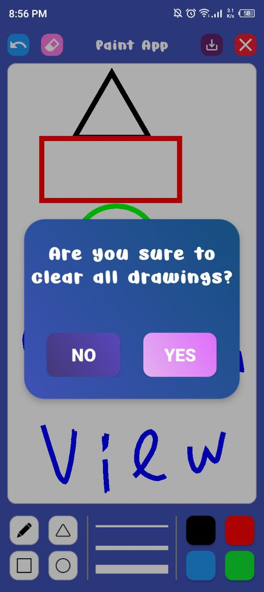
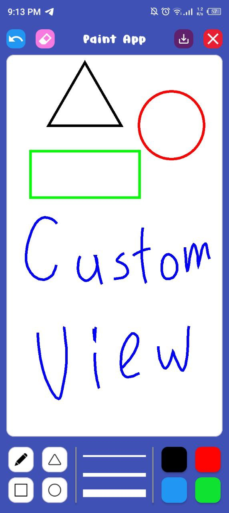

# 🎨 Paint App

Welcome to the Paint App repository! This is a native Android application built using XML and CustomView. The app allows users to draw, customize strokes, and save their artwork to the gallery.

---

## 📱 App Overview

Paint App is a simple yet powerful drawing application that lets users create sketches with different colors, thicknesses, and shapes. The app supports undo functionality, keeping track of changes in a list. Drawings can be saved directly to the gallery for later use.

---

## ⚙️ Technologies Used

- **CustomView** – Enables custom drawing on the canvas.
- **XML** – Used for designing the user interface.
- **Canvas & Paint API** – Core Android components for drawing.
- **File Storage API** – Saves images to the gallery.
- **Undo & Redo Logic** – Keeps track of changes in a list for better control.
- **Color & Thickness Selector** – Allows users to choose different brush styles.

---

## 📸 Screenshots

<table>
  <tr>
    <td></td>
    <td></td>
  </tr>
</table>

---
